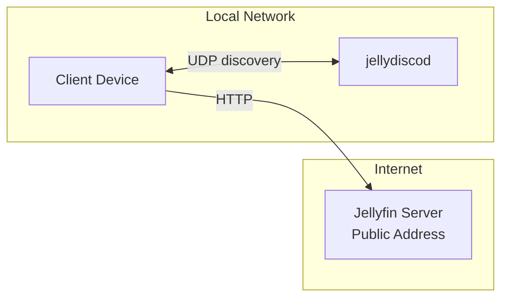
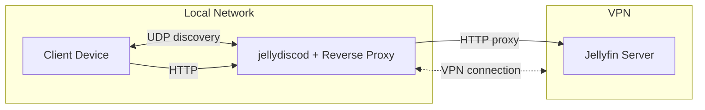

# jellydiscod

Jelly Discovery Daemon is a tool for responding to Jellyfin's autodiscovery protocol that you are a Jellyfin server.

## Use case

There are several reasonable cases where a Jellyfin instance might be accesible via browser/client, but where the autodiscovery protocol can't reach the Jellyfin server. Jelly Discovery Daemon can be run on a network with client devices to announce Jellyfin servers located elsewhere.

For example, Jelly Discovery Daemon could announce the address of Jellyfin servers available via the internet or other WAN connections.

Reverse proxying Jellyfin (e.g. with nginx) works great for the web app. This is useful for e.g. providing access to a remote Jellyfin accessible by VPN without needing to install VPN clients on all devices or wholly interconnect the two networks by VPN routers. However this doesn't support Jellyfin's autodiscovery feature. This can make it hard to find the Jellyfin proxy, especially when you can't/won't reconfigure the network to use custom DNS services (which you'd also have to set up and manage).

This tool will run alongside the reverse proxy and respond to Jellyfin discovery broadcasts. Client apps picking up on it will find their way to the reverse proxy, and all will be well.

## Usage

Run `jellydiscod --help` to see subcommands. Run `jellydiscod <COMMAND> --help` to see detailed options for each subcommand.

### Daemon mode

`jellydiscod daemon`

Daemon mode announces itself to clients as a Jellyfin server.

Calling the tool with no arguments will probably be enough to announce something usable if running on the same host that presents Jellyfin (i.e. in a reverse proxy scenario). Otherwise, you'll probably need to specify `--addr` with the URL of your Jellyfin server, as would be used in a web browser. Use `--bind` if you need to announce to a specific network only.

### Query mode

`jellydiscod query`

Query mode is a simple Jellyfin discovery client for debugging/testing jellydiscod. It broadcasts to discover Jellyfin servers (or jellydiscod daemons) and prints the returns.

## Protocol

Based on Jellyfin 10.11.6 source. The protocol doesn't seem to be specifically documented anywhere.

Clients UDP broadcast on port 7359 the UTF8 string `who is JellyfinServer?`, or actually any string satisfying `text.Contains("who is JellyfinServer?", StringComparison.OrdinalIgnoreCase)`.

Response is like:

`{"Address":"http://192.168.321.789:8096","Id":"abcdefabcdef123123123abcdefabcde","Name":"My Jellyfin Server","EndpointAddress":null}`

"Address" is the URL of the Jellyfin server. "Name" is the string that will be displayed to users. The other fields I have not determined the function of, but jellydiscod serves appropriate defaults that seem to work.